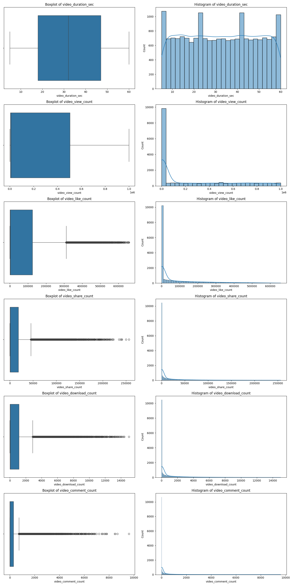
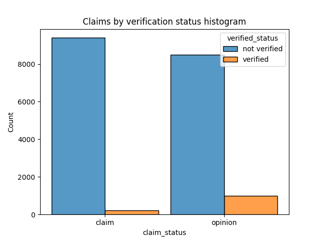
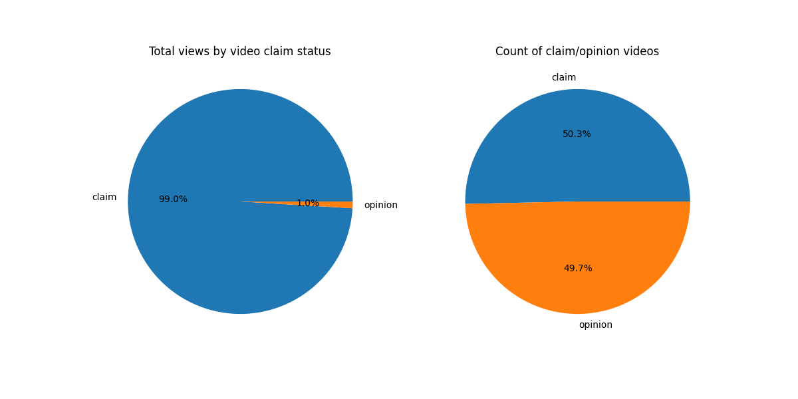
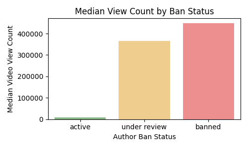

# 🎥 Video Claim vs Opinion Analysis Project

## 📖 Introduction  
This project aims to explore differences between videos classified as "claim" and "opinion" through **exploratory data analysis (EDA)**. The goal is to identify trends, user behaviors, and outliers that provide insights into how these two groups differ, particularly in terms of engagement metrics like view and like counts.

---

## 🔍 Background  
While this project includes a predictive modeling goal, the current stage is focused on **EDA** to better understand the dataset. EDA allows us to uncover patterns, spot anomalies, and build hypotheses that will guide the predictive model in the future.

---
## 🖼️ Key Insights and Visualizations  

### 1️⃣ **Distribution of Variables**  
- 📊 Most variables are skewed to the right, which makes sense considering the nature of viral content.

---

### 2️⃣ **User Verification and Content Type**  
- 🔍 Most "claim" videos are uploaded by **unverified users**.  
- ✅ Verified users tend to avoid posting claims, possibly due to stricter platform policies or reputational concerns.

---

### 3️⃣ **View Count Distribution**  
- 📊 Claim videos capture **99% of total views**, reflecting their viral nature.  
- 🌟 Opinion videos, while present in nearly equal numbers, don't receive the same engagement.

---

### 4️⃣ **User Account Status**  
- 🚫 Users under review or banned are more likely to upload claim videos.  
- 📈 These users exhibit **higher median view counts**, suggesting they post more engaging or controversial content.

---

### 5️⃣ **Outlier Detection**  
- ⚡ Outliers were identified using **IQR and median-based methods**, with claim videos having some exceptional cases of virality.  

| Variable             |   Claim |   Opinion |
|:---------------------|--------:|----------:|
| video_view_count     |    2343 |         0 |
| video_like_count     |    3468 |         0 |
| video_share_count    |    3732 |         0 |
| video_download_count |    3733 |         0 |
| video_comment_count  |    3882 |         0 |

---

## 🛠️ CI/CD and Google API Integration  
This project incorporates **Continuous Integration/Continuous Delivery (CI/CD)** to ensure the code is tested on every commit.

### How the Google Sheets API Connection Works:

1. **Google Cloud Platform (GCP) Service Account**:  
   - A service account is set up on GCP with access to the Google Sheets API.  
   - The credentials for this account are saved securely as a JSON file in the virtual machine (Codespaces), **not committed to the repository**.  

2. **Testing the Connection**:  
   - The project uses CI/CD pipelines to test the connection.  
   - The pipeline runs a script to authenticate using the credentials and verify that data can be downloaded from Google Sheets.  

3. **Temporary Files in Codespaces**:  
   - Any temporary files (e.g., downloaded credentials) stored in the virtual machine are fine to delete.  
   - This is because the pipeline only executes **on every commit**, so these files are regenerated as needed during the testing phase.  

---

## 🚀 Next Steps  
1. Transition from EDA to predictive modeling.  
2. Optimize the CI/CD process further for real-world deployment scenarios.  
3. Add more insights as new trends are uncovered in the dataset.

---

## 📄 References  
- Dataset Source: [Coursera Project Website](https://www.coursera.org/)  
- Tools Used: Python, Pandas, Matplotlib, Seaborn, Codespaces, GCP.  

---

Thank you for checking out my project! 😊 Feel free to reach out with any feedback or suggestions. 🙌
